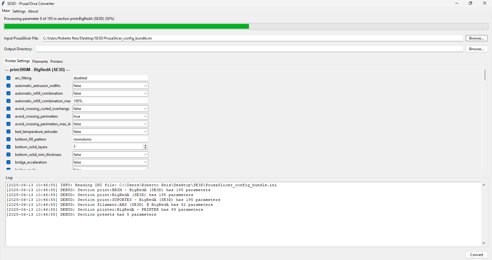
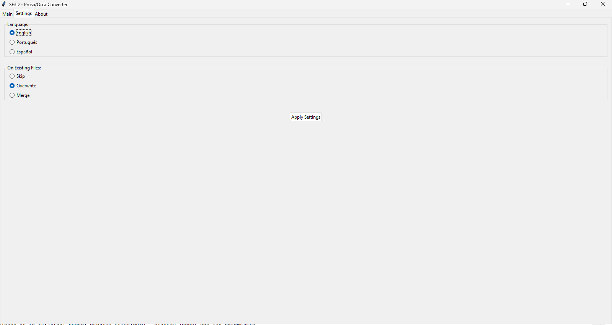
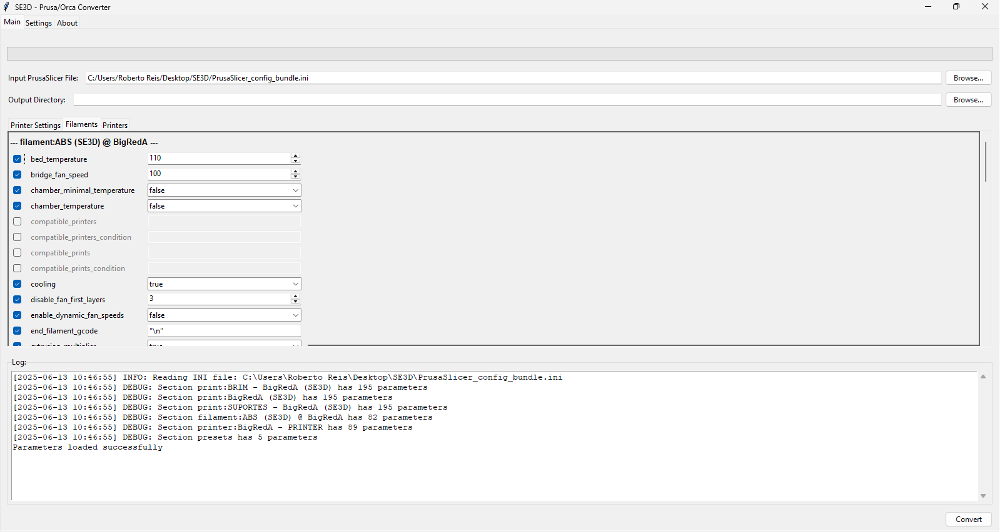
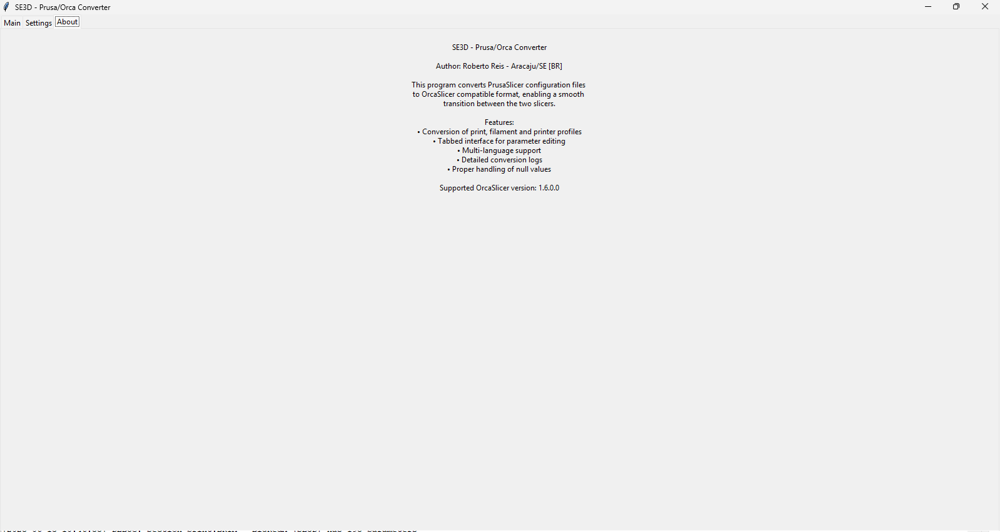

# SE3D - Prusa/Orca Converter



A professional tool for converting PrusaSlicer configuration files to OrcaSlicer format, enabling seamless migration between slicing software.

## Table of Contents

- [Overview](#overview)
- [Features](#features)
- [Screenshots](#screenshots)
- [Installation](#installation)
- [Usage](#usage)
- [Building from Source](#building-from-source)
- [Configuration](#configuration)
- [Supported Parameters](#supported-parameters)
- [Troubleshooting](#troubleshooting)
- [Security Notice](#security-notice)
- [Contributing](#contributing)
- [License](#license)
- [Author](#author)

## Overview

SE3D - Prusa/Orca Converter is a desktop application designed to bridge the gap between PrusaSlicer and OrcaSlicer. It provides an intuitive interface for converting printer profiles, filament settings, and print configurations while maintaining parameter integrity and offering granular control over the conversion process.

**Supported OrcaSlicer Version:** 1.6.0.0

## Features

### Core Functionality
- **Comprehensive Profile Conversion**: Supports print settings, filament profiles, and printer configurations
- **Intelligent Parameter Mapping**: Automatically maps PrusaSlicer parameters to their OrcaSlicer equivalents
- **Visual Parameter Editor**: Edit parameters before conversion with type-aware input widgets
- **Selective Conversion**: Enable/disable individual parameters for fine-grained control

### User Interface
- **Multi-tab Interface**: Organized layout with separate tabs for different configuration types
- **Scrollable Parameter Lists**: Handle large configuration files with ease
- **Real-time Conversion Logs**: Monitor the conversion process with detailed logging
- **Progress Tracking**: Visual progress bar with status updates during file processing

### Internationalization
- **Multi-language Support**: Available in English, Portuguese (Português), and Spanish (Español)
- **Dynamic Language Switching**: Change interface language on-the-fly without restart

### Advanced Features
- **Null Value Handling**: Proper treatment of empty and null parameters
- **Type-aware Input Widgets**: Automatic widget selection based on parameter types (boolean, numeric, enumerated)
- **File Handling Options**: Skip, overwrite, or merge existing configuration files
- **JSON Output Format**: Clean, properly formatted JSON configuration files for OrcaSlicer

## Screenshots

| Main Interface | Settings Panel |
|---------------|----------------|
|  |  |

| Conversion Process | About Dialog |
|-------------------|--------------|
|  |  |

## Installation

### Option 1: Pre-compiled Executable (Windows)

1. Download the latest release from the [Releases](https://github.com/yourusername/prusa2orca/releases) page
2. Extract the archive
3. Run `Prusa2Orca.exe`

**Note:** See [Security Notice](#security-notice) for important information about pre-compiled executables.

### Option 2: Run from Source

**Requirements:**
- Python 3.7 or higher
- tkinter (usually included with Python)

**Steps:**

```bash
# Clone the repository
git clone https://github.com/yourusername/prusa2orca.git
cd prusa2orca

# Run the application
python Prusa2Orca.py
```

No additional packages are required beyond Python's standard library.

## Usage

### Basic Workflow

1. **Select Input File**
   - Click "Browse..." next to "Input PrusaSlicer File"
   - Select your PrusaSlicer `.ini` configuration file

2. **Choose Output Directory**
   - Click "Browse..." next to "Output Directory"
   - Select where converted files should be saved

3. **Review Parameters** (Optional)
   - Navigate through tabs: Printer Settings, Filaments, Printers
   - Enable/disable individual parameters using checkboxes
   - Modify parameter values as needed

4. **Convert**
   - Click the "Convert" button
   - Monitor progress in the log window
   - Converted files will be saved as JSON in the output directory

### Settings Configuration

Access the Settings tab to configure:

- **Language**: Choose between English, Português, or Español
- **File Handling**: Define behavior when output files already exist
  - Skip: Don't overwrite existing files
  - Overwrite: Replace existing files
  - Merge: Combine with existing configurations

## Building from Source

### Creating an Executable with PyInstaller

```bash
# Install PyInstaller
pip install pyinstaller

# Build the executable
pyinstaller --onefile --windowed --icon=Prusa2Orca.ico --name=Prusa2Orca Prusa2Orca.py

# The executable will be in the 'dist' folder
```

### Build Options

- `--onefile`: Create a single executable file
- `--windowed`: Hide console window
- `--icon`: Set application icon
- `--name`: Name of the executable

## Configuration

### Parameter Mapping

The application uses an internal mapping system to convert PrusaSlicer parameters to OrcaSlicer equivalents:

#### Print Settings
| PrusaSlicer | OrcaSlicer |
|------------|-----------|
| `bottom_solid_layers` | `bottom_shell_layers` |
| `fill_pattern` | `sparse_infill_pattern` |
| `fill_density` | `sparse_infill_density` |
| `perimeters` | `wall_loops` |
| `top_solid_layers` | `top_shell_layers` |
| `infill_speed` | `sparse_infill_speed` |
| `perimeter_speed` | `outer_wall_speed` |

#### Filament Settings
| PrusaSlicer | OrcaSlicer |
|------------|-----------|
| `bed_temperature` | `hot_plate_temp` |
| `temperature` | `nozzle_temperature` |
| `first_layer_temperature` | `nozzle_temperature_initial_layer` |

#### Printer Settings
| PrusaSlicer | OrcaSlicer |
|------------|-----------|
| `bed_shape` | `printable_area` |
| `nozzle_diameter` | `nozzle_diameter` |
| `extruder_offset` | `extruder_offset` |

## Supported Parameters

### Parameter Types

The application automatically detects and handles:

- **Boolean Values**: `true`, `false`, `yes`, `no`, `1`, `0`
- **Numeric Values**: Integers and floating-point numbers
- **Enumerated Values**: Predefined options for specific parameters
- **Text Values**: Free-form text input

### Special Parameters

- **Infill Patterns**: rectilinear, grid, triangles, cubic, line, concentric, honeycomb, 3dhoneycomb, hilbertcurve
- **Filament Types**: PLA, ABS, PETG, TPU, ASA, PC, PA, PVA, HIPS
- **Support Material**: Boolean enable/disable

## Troubleshooting

### Common Issues

**Q: The application won't start**
- Ensure you have Python 3.7+ installed
- Verify tkinter is available: `python -m tkinter`
- Check that all required files are present

**Q: Conversion fails with "No configurations found"**
- Verify the input file is a valid PrusaSlicer `.ini` file
- Check file encoding (should be UTF-8)
- Ensure the file contains valid configuration sections

**Q: Output files are missing parameters**
- Parameters must be enabled (checkbox checked) to be included
- Empty or null values are disabled by default
- Check the log for conversion warnings

**Q: Interface appears in wrong language**
- Go to Settings tab and select your preferred language
- Click "Apply Settings" to update the interface

### Reporting Issues

When reporting issues, please include:
- Operating system and version
- Python version (if running from source)
- Input file format and size
- Complete error message from the log
- Steps to reproduce the problem

## Security Notice

### Important Security Information

For maximum security, it is strongly recommended to compile your own executable from the Python source code. Pre-compiled executables are provided for convenience to users unfamiliar with software compilation.

**Recommendations:**
1. Review the source code before use
2. Build your own executable using the instructions above
3. Verify the integrity of downloaded files
4. Run in a sandboxed environment when testing

**Disclaimer:** The author cannot be held responsible for any issues arising from using pre-built executables. Use at your own discretion.

## Contributing

Contributions are welcome! Here's how you can help:

1. **Fork the repository**
2. **Create a feature branch**: `git checkout -b feature/amazing-feature`
3. **Commit your changes**: `git commit -m 'Add amazing feature'`
4. **Push to the branch**: `git push origin feature/amazing-feature`
5. **Open a Pull Request**

### Development Guidelines

- Follow PEP 8 style guidelines
- Add docstrings to all functions and classes
- Test changes with various configuration files
- Update documentation for new features
- Maintain compatibility with Python 3.7+

### Translation Contributions

To add a new language:

1. Add language code to `LANGUAGES` dictionary
2. Create translation entries in `TRANSLATIONS` dictionary
3. Add corresponding text in `ABOUT_TEXTS`
4. Test all interface elements with new language

## License

This project is licensed under the GNU General Public License v3.0 - see the [LICENSE](LICENSE) file for details.

### GNU GPL v3.0 Summary

This program is free software: you can redistribute it and/or modify it under the terms of the GNU General Public License as published by the Free Software Foundation, either version 3 of the License, or (at your option) any later version.

This program is distributed in the hope that it will be useful, but WITHOUT ANY WARRANTY; without even the implied warranty of MERCHANTABILITY or FITNESS FOR A PARTICULAR PURPOSE. See the GNU General Public License for more details.

You should have received a copy of the GNU General Public License along with this program. If not, see <https://www.gnu.org/licenses/>.

## Author

**Roberto Reis**  
Location: Aracaju, Sergipe, Brazil  
Project: SE3D - Prusa/Orca Converter

### Contact

For questions, suggestions, or support:
- Open an issue on GitHub
- Submit a pull request
- Check existing documentation and issues first

## Acknowledgments

- PrusaSlicer team for their excellent slicing software
- OrcaSlicer team for their innovative fork
- The 3D printing community for feedback and testing
- All contributors who help improve this tool

---

**Made with ❤️ for the 3D printing community**

*If you find this tool useful, please consider giving it a star ⭐ on GitHub!*
